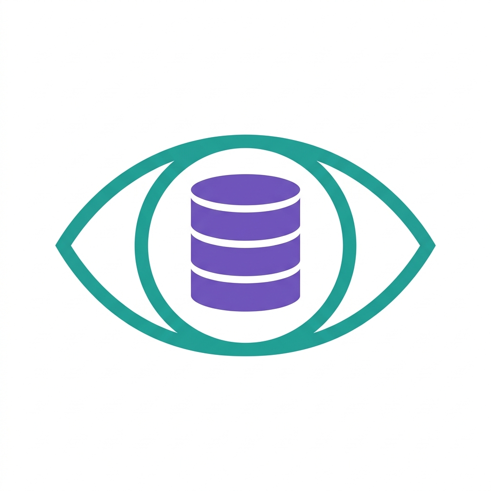
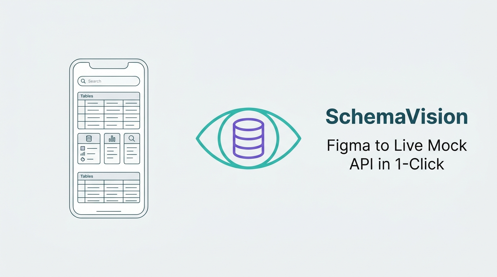
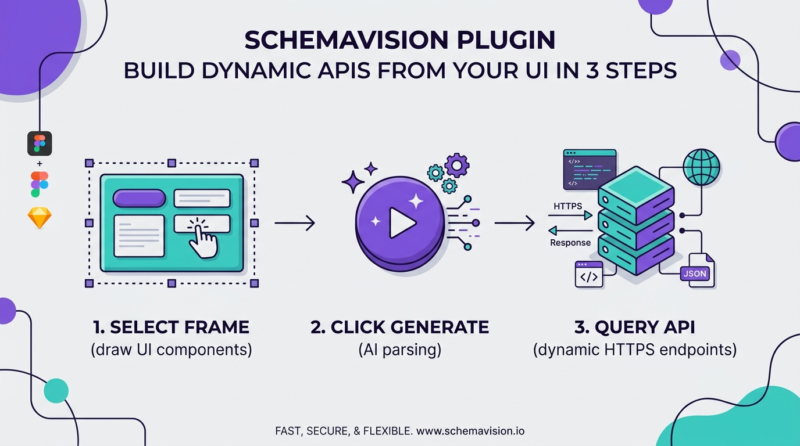

# SchemaVision

> **Convert Figma UI designs into live cloud-hosted mock API servers instantly.**

SchemaVision is a modern Figma plugin that bridges the gap between design and front-end development. Using advanced AI vision models, it inspects your visual design layouts, structures clean OpenAPI 3.0 specs, and automatically deploys a secure staging mock server on Google Cloud Run. 

Front-end developers and UI/UX designers can hook their React, Flutter, Swift, or web apps directly to these live HTTPS endpoints (`/products`, `/users`, etc.) in seconds, without writing a single line of backend database or server routing code.

---

## Branding Assets

### Logo Icon

### Marketplace Banner

### Infographic Step-by-Step

---

## Key Features

*   **1-Click Server Provisioning:** Draw a UI frame in Figma, click "Generate," and immediately receive a live HTTPS URL containing endpoints that match your visual data.
*   **Relational AI Mock Data:** Automatically generates realistic mock data based on the semantic layout of your UI design.
*   **High-Fidelity Refills:** Upgrades mock server data dynamically to hold up to 100 rows of relational mockup data.
*   **Express Code Eject (.zip):** Instantly downloads the full NodeJS/TypeScript Express server codebase, Swagger configuration, and Dockerfile ready to host on your own staging cluster.
*   **Subscription-Based Persistent Staging:** Hosts mock endpoints permanently with custom CORS configurations.

---

## Get Started

1.  Open the **Figma Community Marketplace**.
2.  Install the **[SchemaVision Plugin](https://www.figma.com/community/plugin/1655609291675731157)**.
3.  Select any design frame on your Figma canvas.
4.  Run the plugin and click **Generate API Schema**!
